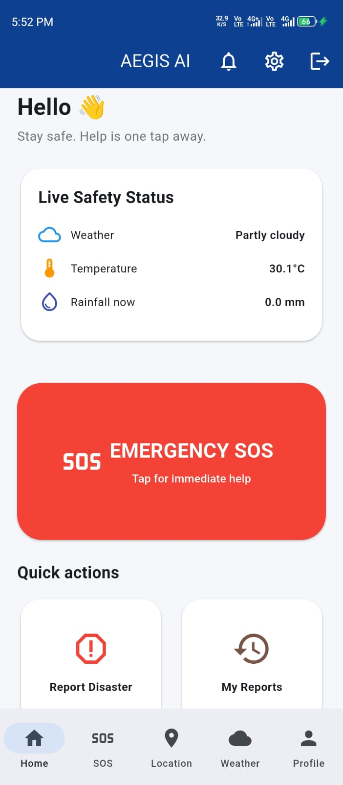
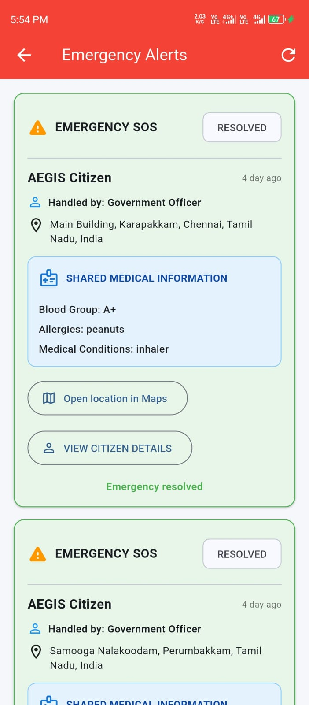
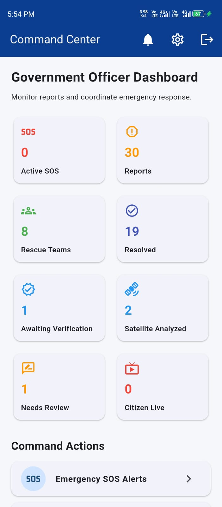
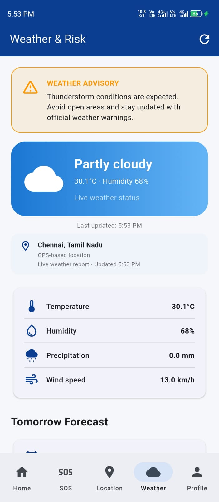
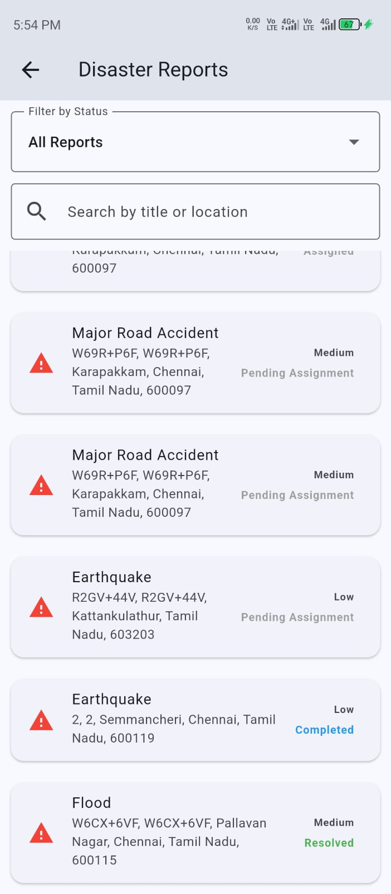

# 🛡️ AEGIS

## AI-Enabled Emergency & Incident Response Application

AEGIS is a Flutter-based emergency response application
designed to support incident reporting, response coordination,
and operational management through a centralized digital platform.

The application focuses on improving the way emergency
incidents are reported, managed, and coordinated.

---

## 🚨 Key Features

- 🚨 Emergency incident reporting
- 📍 Incident and response workflows
- 👮 Officer dashboard
- 📋 Digital checklists
- 📊 Checklist and incident reports
- 🔐 Role-based application workflows
- ☁️ Firebase integration
- 📱 Cross-platform application

---

## 👮 Officer Dashboard

AEGIS includes an officer-focused dashboard designed to help
response personnel manage operational activities.

The dashboard includes:

- Officer workflow management
- Digital checklists
- Checklist reporting
- Incident-related information
- Operational records

---

## 🛠️ Technologies

| Technology | Purpose |
|---|---|
| Flutter | Application development |
| Dart | Programming language |
| Firebase | Backend / cloud services |
| Git | Version control |
| GitHub | Source code management |

---

## 📱 Supported Platforms

AEGIS is built using Flutter and is structured for
cross-platform development.

- 📱 Android
- 🌐 Web
- 🪟 Windows
- 🐧 Linux
- 🍎 macOS

---

## 🎯 Problem Being Addressed

Emergency situations require information to be communicated
quickly and managed in an organized manner.

AEGIS aims to provide a centralized digital platform for
incident reporting, emergency workflows, officer activities,
checklists, and operational reporting.

---

## 🔄 Application Workflow

```text
Emergency / Incident
        ↓
Incident Reporting
        ↓
Response Coordination
        ↓
Officer Dashboard
        ↓
Digital Checklist
        ↓
Checklist / Incident Report


🔒 Project Status

AEGIS is currently a development/prototype project created
to demonstrate an emergency response and incident management
solution.

It is not intended to replace official emergency services
or emergency response systems.

---

## 📸 Application Screenshots

### 🏠 Application Interface


### 🚨 Emergency / Incident Management


### 👮 Officer Dashboard


### 📋 Digital Checklist


### 📊 Reports


---

👨‍💻 Developer

Ariharan

Web & App Developer

🔗 GitHub:
https://github.com/ariharankpr2007-cpu

⭐ If you find this project interesting, feel free to explore
the repository.
